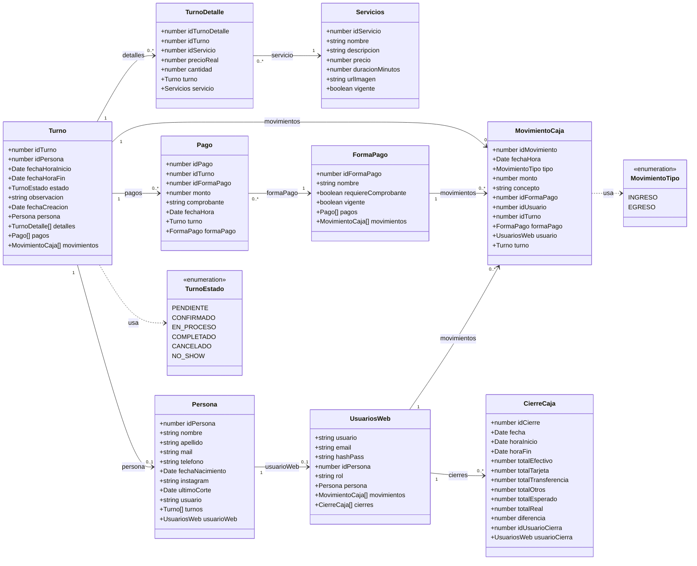
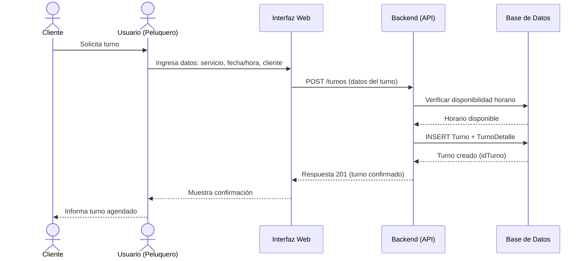
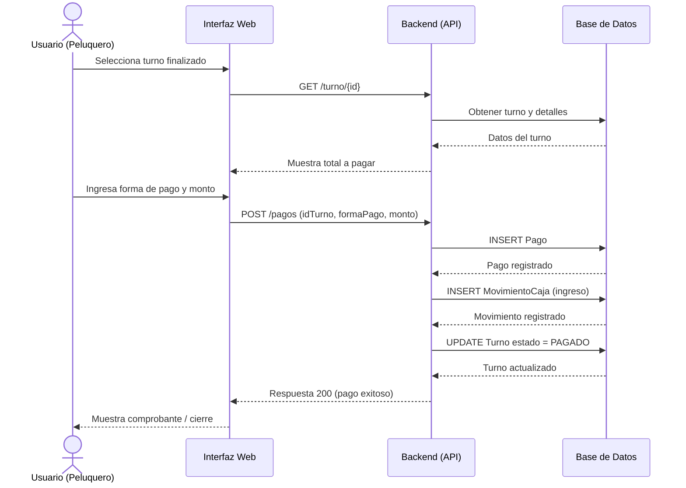
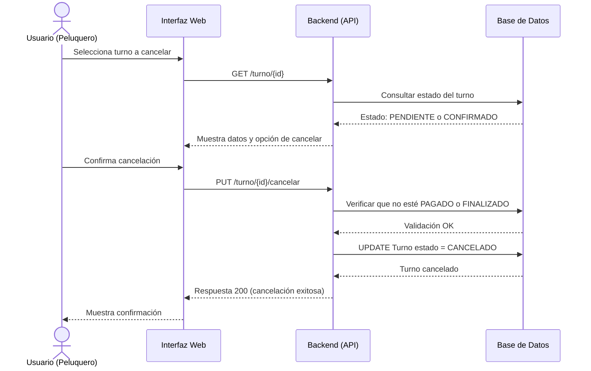
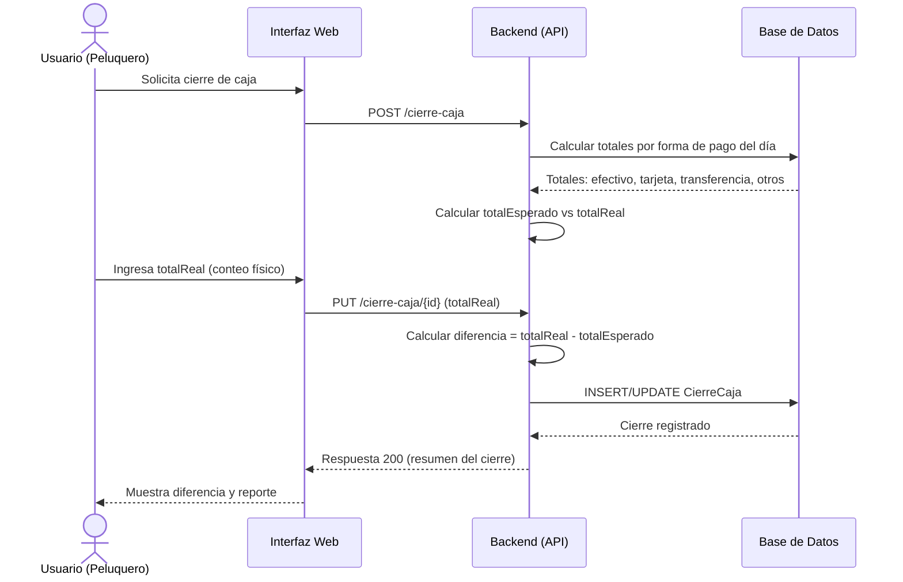
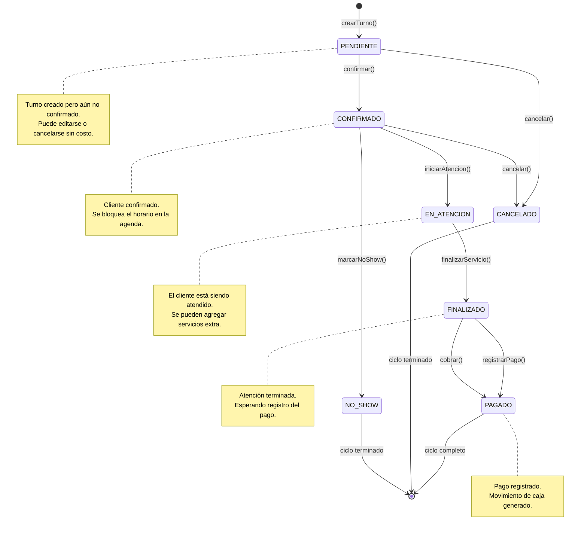
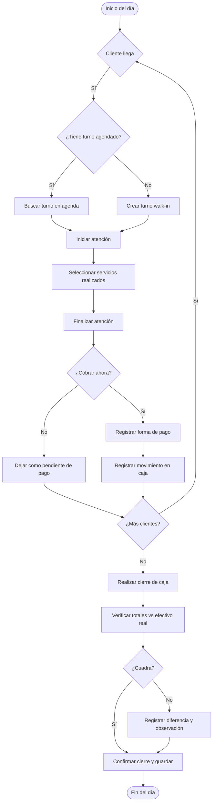

# CONTEXTO COMPLETO – Sistema de Gestión para Peluquería

## 1. Descripción del Proyecto

Sistema de gestión integral para una peluquería con un único profesional. El sistema debe permitir gestionar la agenda de turnos, el catálogo de servicios, los pagos, los movimientos de caja diarios y el cierre de caja. No hay múltiples profesionales, por lo que el modelo no incluye gestión de staff.

---

## 2. Requisitos Funcionales

- **Gestión de Servicios**: ABM de servicios (corte, color, barba, etc.) con precio, duración e imagen.
- **Gestión de Turnos**: Crear, editar, cancelar y finalizar turnos. Un turno puede incluir múltiples servicios.
- **Gestión de Clientes**: Registro de personas (clientes) con datos de contacto, historial de cortes e Instagram.
- **Pagos**: Registrar pagos por turno, soportando múltiples formas de pago (efectivo, tarjeta, transferencia, etc.) y pagos parciales/mixtos.
- **Caja / Movimientos**: Registrar todos los ingresos y egresos del día. Los ingresos se generan automáticamente al cobrar un turno, pero también debe permitir registrar egresos (retiro de efectivo, compra de insumos, etc.).
- **Cierre de Caja**: Arqueo diario comparando lo esperado vs lo real (conteo físico) por forma de pago.
- **Usuarios y Roles**: Autenticación con roles (admin/peluquero). Por ahora solo hay un usuario, pero el modelo soporta extensión.
- **Integración con Google Calendar**: Sincronizar los turnos del sistema con el calendario de Google del peluquero.

---

## 3. Diagrama Entidad-Relación (Base de Datos)

### Entidades

- **Servicios**: idServicio, nombre, descripcion, precio, duracionMinutos, urlImagen, vigente.
- **Turno**: idTurno, idPersona, fechaHoraInicio, fechaHoraFin, estado, observacion, fechaCreacion.
- **TurnoDetalle**: idTurnoDetalle, idTurno, idServicio, precioReal, cantidad (DEFAULT 1).
- **Persona**: idPersona, nombre, apellido, mail, telefono, fechaNacimiento, instagram, ultimoCorte, usuario.
- **UsuariosWeb**: usuario (PK), email, hashPass, idPersona, rol.
- **FormaPago**: idFormaPago, nombre, requiereComprobante, vigente.
- **Pago**: idPago, idTurno, idFormaPago, monto, comprobante, fechaHora.
- **MovimientoCaja**: idMovimiento, fechaHora, tipo (INGRESO/EGRESO), monto, concepto, idFormaPago, idUsuario, idTurno (nullable).
- **CierreCaja**: idCierre, fecha, horaInicio, horaFin, totalEfectivo, totalTarjeta, totalTransferencia, totalOtros, totalEsperado, totalReal, diferencia, idUsuarioCierra.

### Relaciones

- Persona (1) → Turno (N)
- Turno (1) → TurnoDetalle (N)
- Servicios (1) → TurnoDetalle (N)
- Turno (1) → Pago (N)
- FormaPago (1) → Pago (N)
- Turno (1) → MovimientoCaja (0..1)
- FormaPago (1) → MovimientoCaja (N)
- UsuariosWeb (1) → MovimientoCaja (N)
- UsuariosWeb (1) → Persona (1)
- UsuariosWeb (1) → CierreCaja (N)

### Diagrama Mermaid

```mermaid
erDiagram
    Servicios {
        INT idServicio PK "IDENTITY"
        VARCHAR nombre
        TEXT descripcion
        DECIMAL precio
        INT duracionMinutos
        VARCHAR urlImagen
        BOOLEAN vigente
    }

    Turno {
        INT idTurno PK "IDENTITY"
        INT idPersona FK
        DATETIME fechaHoraInicio
        DATETIME fechaHoraFin
        VARCHAR estado
        TEXT observacion
        DATETIME fechaCreacion
    }

    TurnoDetalle {
        INT idTurnoDetalle PK "IDENTITY"
        INT idTurno FK
        INT idServicio FK
        DECIMAL precioReal
        INT cantidad DEFAULT 1
    }

    Persona {
        INT idPersona PK "IDENTITY"
        VARCHAR nombre
        VARCHAR apellido
        VARCHAR mail
        VARCHAR telefono
        DATE fechaNacimiento
        VARCHAR instagram
        DATETIME ultimoCorte
        VARCHAR usuario FK
    }

    UsuariosWeb {
        VARCHAR usuario PK
        VARCHAR email
        VARCHAR hashPass
        INT idPersona FK
        CHAR rol
    }

    FormaPago {
        INT idFormaPago PK "IDENTITY"
        VARCHAR nombre
        BOOLEAN requiereComprobante
        BOOLEAN vigente
    }

    Pago {
        INT idPago PK "IDENTITY"
        INT idTurno FK
        INT idFormaPago FK
        DECIMAL monto
        VARCHAR comprobante
        DATETIME fechaHora
    }

    MovimientoCaja {
        INT idMovimiento PK "IDENTITY"
        DATETIME fechaHora
        VARCHAR tipo
        DECIMAL monto
        VARCHAR concepto
        INT idFormaPago FK
        INT idUsuario FK
        INT idTurno FK "NULL"
    }

    CierreCaja {
        INT idCierre PK "IDENTITY"
        DATE fecha
        DATETIME horaInicio
        DATETIME horaFin
        DECIMAL totalEfectivo
        DECIMAL totalTarjeta
        DECIMAL totalTransferencia
        DECIMAL totalOtros
        DECIMAL totalEsperado
        DECIMAL totalReal
        DECIMAL diferencia
        INT idUsuarioCierra FK
    }

    Persona ||--o{ Turno : "idPersona"
    Turno ||--o{ TurnoDetalle : "idTurno"
    Servicios ||--o{ TurnoDetalle : "idServicio"
    Turno ||--o{ Pago : "idTurno"
    FormaPago ||--o{ Pago : "idFormaPago"
    Turno ||--o| MovimientoCaja : "idTurno"
    FormaPago ||--o{ MovimientoCaja : "idFormaPago"
    UsuariosWeb ||--o{ MovimientoCaja : "idUsuario"
    UsuariosWeb ||--o{ Persona : "idPersona"
    UsuariosWeb ||--o{ CierreCaja : "idUsuarioCierra"
```

---

## 4. Diagrama de Clases (TypeScript)

### Clases principales

- **Servicios**: idServicio, nombre, descripcion, precio, duracionMinutos, urlImagen, vigente.
- **Turno**: idTurno, idPersona, fechaHoraInicio, fechaHoraFin, estado (enum), observacion, fechaCreacion, persona, detalles, pagos, movimientos.
- **TurnoDetalle**: idTurnoDetalle, idTurno, idServicio, precioReal, cantidad, turno, servicio.
- **Persona**: idPersona, nombre, apellido, mail, telefono, fechaNacimiento, instagram, ultimoCorte, usuario, turnos, usuarioWeb.
- **UsuariosWeb**: usuario, email, hashPass, idPersona, rol, persona, movimientos, cierres.
- **FormaPago**: idFormaPago, nombre, requiereComprobante, vigente, pagos, movimientos.
- **Pago**: idPago, idTurno, idFormaPago, monto, comprobante, fechaHora, turno, formaPago.
- **MovimientoCaja**: idMovimiento, fechaHora, tipo (enum), monto, concepto, idFormaPago, idUsuario, idTurno, formaPago, usuario, turno.
- **CierreCaja**: idCierre, fecha, horaInicio, horaFin, totalEfectivo, totalTarjeta, totalTransferencia, totalOtros, totalEsperado, totalReal, diferencia, idUsuarioCierra, usuarioCierra.

### Enums

- **TurnoEstado**: PENDIENTE, CONFIRMADO, EN_PROCESO, COMPLETADO, CANCELADO, NO_SHOW.
- **MovimientoTipo**: INGRESO, EGRESO.

### Diagrama Mermaid



---

## 5. Diagramas de Secuencia

### 5.1. Agendar Turno

**Flujo**: El cliente solicita un turno (por teléfono o presencial). El peluquero ingresa los datos en la interfaz. El sistema verifica disponibilidad, crea el turno y sus detalles de servicio.

**Participantes**: Cliente (actor), Usuario/Peluquero (actor), Interfaz Web, Backend API, Base de Datos.



### 5.2. Cobrar en Caja

**Flujo**: El peluquero selecciona un turno finalizado. El sistema muestra el total a pagar. El peluquero ingresa la forma de pago y el monto. El sistema registra el pago, genera un movimiento de caja (ingreso) y actualiza el estado del turno a PAGADO.

**Participantes**: Usuario/Peluquero (actor), Interfaz Web, Backend API, Base de Datos.



### 5.3. Cancelar Turno

**Flujo**: El peluquero selecciona un turno y solicita cancelarlo. El sistema verifica que el turno no esté PAGADO o FINALIZADO. Si está PENDIENTE o CONFIRMADO, se actualiza el estado a CANCELADO.

**Participantes**: Usuario/Peluquero (actor), Interfaz Web, Backend API, Base de Datos.



### 5.4. Cierre de Caja Diario

**Flujo**: El peluquero solicita el cierre del día. El sistema calcula los totales esperados por forma de pago sumando todos los movimientos del día. El peluquero ingresa el conteo físico real. El sistema calcula la diferencia y guarda el registro.

**Participantes**: Usuario/Peluquero (actor), Interfaz Web, Backend API, Base de Datos.



---

## 6. Diagrama de Estados – Turno

**Propósito**: Modelar el ciclo de vida completo de un turno desde su creación hasta su finalización.

**Estados**: PENDIENTE, CONFIRMADO, EN_ATENCION, FINALIZADO, PAGADO, CANCELADO, NO_SHOW.

**Reglas**:
- PENDIENTE: Turno creado pero no confirmado. Se puede editar o cancelar.
- CONFIRMADO: Cliente confirmado. Se bloquea el horario en la agenda.
- EN_ATENCION: El cliente está siendo atendido. Se pueden agregar servicios extra.
- FINALIZADO: Atención terminada. Esperando registro del pago.
- PAGADO: Pago registrado y movimiento de caja generado.
- CANCELADO: Turno cancelado. Libera el horario.
- NO_SHOW: Cliente no asistió. No genera ingreso.



---

## 7. Diagrama de Actividades – Flujo del Día

**Propósito**: Visualizar el flujo de trabajo global en la peluquería durante una jornada completa.

**Flujo**:
1. Inicio del día.
2. El cliente llega. Si tiene turno agendado, se busca en la agenda. Si no, se crea un turno walk-in.
3. Se inicia la atención y se seleccionan los servicios realizados.
4. Se finaliza la atención.
5. Se decide si se cobra ahora o se deja como pendiente de pago.
6. Si se cobra, se registra la forma de pago y se genera un movimiento de caja.
7. Si hay más clientes, se repite el ciclo.
8. Al final del día, se realiza el cierre de caja.
9. Se verifica si los totales cuadran con el conteo físico.
10. Si no cuadra, se registra la diferencia y observación.
11. Se confirma el cierre y guarda.



---

## 8. Patrones de Diseño Seleccionados

**Principios base**: SOLID, DRY, KISS. **Filosofía**: Menos es más.

Se evaluó un catálogo completo de patrones (creacionales, estructurales, de comportamiento). Se descartaron todos los que el framework (Angular / NestJS) o el lenguaje (TypeScript) ya resuelven nativamente, o que añaden complejidad innecesaria para un sistema de un único profesional.

**Patrones aplicados**:

| Patron | Aplicacion | Principio que cumple | Justificacion |
|--------|------------|----------------------|---------------|
| **Builder** | Creacion de `Turno` con multiples detalles y configuraciones | SRP | Evita constructores con 8+ parametros. Permite construir turnos complejos paso a paso. |
| **Inmutabilidad con copia** | Angular Signals (`signal<Readonly<Turno>>`) y DTOs inmutables en NestJS | KISS / SRP | Obligatorio con Signals (zoneless). Evita side effects. El estado solo muta a traves de metodos controlados. |
| **Adapter** | Google Calendar API (`GoogleCalendarAdapter`) y mappers del ORM | DIP / OCP | Convierte `Turno` al formato de Google Calendar. Si mañana cambia a Outlook, solo se toca el adapter. |
| **Facade** | `CajaFacade` que expone un solo metodo `procesarPago(turnoId, formaPago)` | SRP / KISS | Por dentro coordina: registra Pago, crea MovimientoCaja, actualiza Turno a PAGADO, y dispara sincronizacion. El resto del sistema no necesita saber como funciona la caja por dentro. |
| **State** | Ciclo de vida del `Turno` (PENDIENTE -> CONFIRMADO -> EN_ATENCION -> FINALIZADO -> PAGADO) | SRP / OCP | El diagrama de estados ya lo pide. Cada estado encapsula sus reglas de transicion (ej: solo cancelar si esta PENDIENTE o CONFIRMADO). |
| **Strategy** | Calculo de totales de `CierreCaja` por forma de pago (`EfectivoStrategy`, `TarjetaStrategy`, `TransferenciaStrategy`) | OCP | Evita `if/else` en el cierre cada vez que se agrega una forma de pago. Permite agregar nuevas estrategias sin modificar codigo existente. |
| **Strategy** | Calculo de precios de `Turno` (con/sin descuentos futuros) | OCP | Hoy no hay descuentos, pero mañana si. `PrecioCalculator` con estrategias evita refactorizar. |
| **Observer / Mediator** | NestJS EventBus (`PagoCreadoEvent` -> `CajaListener`, `CalendarListener`) | DIP / SRP / DRY | Cuando se ejecuta `PagoCreadoEvent`, el modulo de Caja escucha y genera el MovimientoCaja, y el modulo de Google Calendar escucha y marca el evento como completado. El `TurnoService` no conoce a `CajaService` ni a `CalendarService`. |

**Patrones descartados** (overkill para este proyecto):

| Patron | Razon de descarte |
|--------|-------------------|
| Abstract Factory | No hay familias de productos relacionados. Factory Method o Factory Function es suficiente. |
| Prototype | JavaScript tiene spread operator y `structuredClone`. No se necesita clonar manualmente. |
| Singleton | Angular y NestJS ya manejan sus servicios como singletons via DI. No implementar a mano. |
| Bridge / Composite / Flyweight | No hay jerarquias de abstraccion complejas ni arboles de objetos masivos. |
| Proxy | NestJS ya tiene Interceptors, Guards y Pipes. |
| Chain of Responsibility | Para validaciones, usar `ValidationPipe` o un array de validadores. |
| Command | No se necesita una cola de "deshacer" (undo) en la caja. |
| Memento | Guardar snapshots se resuelve con el log de `MovimientoCaja` o historial de estados. |
| Visitor | La estructura de objetos no es estable ni compleja. Agregar operaciones se hace con Strategy. |
| Template Method | Strategy es mas flexible. Template Method fuerza a heredar; Strategy a componer (preferible en TS). |

---

## 9. Stack Tecnológico

### Frontend
- **Framework**: Angular (ultima version estable)
- **Estado**: Signals (Zoneless)
- **CSS**: Tailwind CSS
- **Componentes**: Se debe investigar la libreria de componentes a utilizar (opciones: Angular Material, PrimeNG, NG-ZORRO, shadcn/ui angular, etc.)

### Backend
- **Framework**: NestJS
- **Base de Datos**: PostgreSQL
- **ORM**: **Prisma** (ver justificación en sección 9.1)
- **Contenedores**: Docker (para la base de datos y eventualmente el backend)
- **API**: RESTful

### Integraciones
- **Google Calendar**: Conectar los turnos del sistema con el calendario de Google del peluquero para sincronizacion bidireccional o unidireccional.

### Consideraciones
- El sistema es para un unico profesional, por lo que no se requiere multi-tenancy ni gestion de multiples profesionales por ahora.
- La autenticacion debe ser simple pero extensible (JWT en NestJS).
- El frontend debe ser responsive para usar desde tablet o celular en la peluqueria.

---

## 9.1. Justificación de la Elección del ORM: Prisma

### Contexto de la decisión

Se evaluaron dos opciones principales para el ORM: **Prisma** y **TypeORM**. Ambos son compatibles con NestJS, TypeScript y PostgreSQL, pero presentan diferencias fundamentales en arquitectura, developer experience y mantenimiento a largo plazo.

### Comparación directa

| Criterio | Prisma | TypeORM |
|----------|--------|---------|
| **Integración NestJS** | Excelente (`@nestjs/prisma`) | Muy buena (nativa) |
| **Tipado compartido con Angular** | **Perfecto** (genera interfaces automáticamente desde el schema) | Manual |
| **Modelo relacional simple** | Ideal | Funciona |
| **Patrón State (métodos en entidades)** | Requiere capa de Mapper | Nativo en la clase entity |
| **Migrations** | **Automáticas y confiables** (`prisma migrate dev`) | Más manuales, menos confiables |
| **Curva inicial** | Muy baja (schema declarativo) | Media (decoradores + configuración) |
| **Docker / PostgreSQL** | Funciona igual | Funciona igual |
| **Mantenimiento del proyecto** | Activo, moderno, con releases frecuentes | Estancado, PRs sin mergear, bugs sin resolver |
| **Type safety** | **Muy fuerte** (genera tipos desde el schema) | Media (repositorios genéricos a veces fallan) |

### Ventajas de Prisma para este proyecto

1. **TypeScript nativo**: El schema declarativo (`schema.prisma`) genera tipos automáticamente. Estos tipos pueden compartirse con el frontend (Angular) vía una librería compartida (`@peluqueria/shared-types`), eliminando errores de tipado entre capas.
2. **Developer Experience**: Autocompletado perfecto en el IDE. Query engine ligero. `prisma migrate dev` es confiable y automático, ideal para iterar el modelo de datos en desarrollo.
3. **Seguridad**: Construye queries seguras por defecto (sin SQL injection). Validación automática en el nivel de base de datos.
4. **KISS**: El schema declarativo es más simple que decorar clases con `@Entity`, `@Column`, `@JoinColumn`. Se alinea con el principio de simplicidad del proyecto.
5. **Eficiencia para un solo desarrollador**: Permite iterar el modelo de datos en minutos. El schema es la fuente de verdad única.

### Desventajas de Prisma y mitigación

- **Objetos planos**: Prisma devuelve objetos planos (DTOs), no entidades de dominio con comportamiento. Para aplicar el patrón **State** en el `Turno` (métodos como `cancelar()`, `iniciarAtencion()`), se requiere una capa de **Mapper**:

```typescript
// Prisma devuelve esto (plano)
const prismaTurno = await prisma.turno.findUnique({...});

// Mapper convierte a entidad de dominio con comportamiento
const turno = TurnoMapper.toDomain(prismaTurno);
turno.iniciarAtencion(); // Ahora tiene el método del patrón State
```

Esta capa de Mapper es una **buena práctica en DDD** (Domain-Driven Design) de todos modos, ya que mantiene el dominio limpio de la base de datos.

### Desventajas de TypeORM (críticas para este proyecto)

- **Mantenimiento irregular**: En los últimos 2-3 años la comunidad reportó PRs sin mergear, bugs sin resolver y releases espaciados.
- **Migraciones menos confiables**: Comparado con Prisma, puede generar migraciones incompletas o destructivas. Requiere más revisión manual.
- **Type safety más débil**: Los repositorios genéricos (`Repository<T>`) a veces no inferen tipos correctamente en queries complejas.
- **Configuración inicial**: Requiere más boilerplate para configurar con NestJS.

### Conclusión

> **Se elige Prisma**. Es moderno, rápido, type-safe y perfecto para la arquitectura actual (NestJS + Angular + PostgreSQL). Permite avanzar rápido sin sacrificar calidad, manteniendo la simplicidad que requiere un sistema de un único profesional.

### ¿Cuándo se habría elegido TypeORM?

Solo si el dominio se volviera extremadamente complejo (muchos comportamientos en entidades, lógica de negocio embebida en métodos de clase) y se quisiera que el ORM **sea** el modelo de dominio. Para una peluquería con un solo profesional, eso es **overkill**.

---

## 10. Notas para el Desarrollo

- **TurnoDetalle** guarda `precioReal` porque el precio de los servicios puede cambiar en el tiempo, pero el cobro historico debe permanecer intacto.
- **MovimientoCaja** tiene `idTurno` nullable porque pueden existir movimientos sin turno asociado (ej: compra de insumos, retiro de efectivo).
- **CierreCaja** debe poder recalcularse si hay errores, pero una vez confirmado debe quedar inmutable.
- **Pagos**: Soportar pagos mixtos (ej: 50% efectivo, 50% tarjeta) para un mismo turno. Por eso Pago es 1:N con Turno.
- **Google Calendar**: Se debe investigar la API de Google Calendar (v3) y OAuth2 para la autenticacion del peluquero.
- **Prisma Mapper**: Se recomienda implementar una capa de mapeo entre los objetos planos de Prisma y las entidades de dominio (con comportamiento) para mantener la arquitectura limpia y facilitar el uso de patrones como State y Strategy.

---

## 11. Archivos Generados en este Proyecto

1. `/home/leeo/diagrama-er.md` – Diagrama Entidad-Relacion.
2. `/home/leeo/diagrama-clases.md` – Diagrama de Clases TypeScript.
3. `/home/leeo/diagramas-procesos.md` – Diagramas de Secuencia, Estados y Actividades.
4. `/home/leeo/contexto-proyecto.md` – Este documento (contexto completo).

---

*Fin del documento de contexto.*
