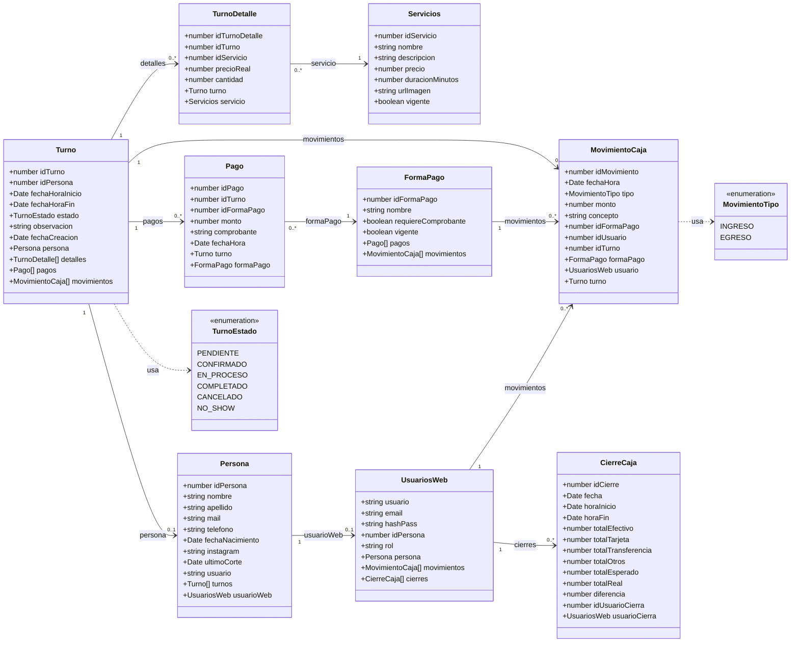

```mermaid
classDiagram
    direction LR

    class Servicios {
        +number idServicio
        +string nombre
        +string descripcion
        +number precio
        +number duracionMinutos
        +string urlImagen
        +boolean vigente
    }

    class Turno {
        +number idTurno
        +number idPersona
        +Date fechaHoraInicio
        +Date fechaHoraFin
        +TurnoEstado estado
        +string observacion
        +Date fechaCreacion
        +Persona persona
        +TurnoDetalle[] detalles
        +Pago[] pagos
        +MovimientoCaja[] movimientos
    }

    class TurnoDetalle {
        +number idTurnoDetalle
        +number idTurno
        +number idServicio
        +number precioReal
        +number cantidad
        +Turno turno
        +Servicios servicio
    }

    class Persona {
        +number idPersona
        +string nombre
        +string apellido
        +string mail
        +string telefono
        +Date fechaNacimiento
        +string instagram
        +Date ultimoCorte
        +string usuario
        +Turno[] turnos
        +UsuariosWeb usuarioWeb
    }

    class UsuariosWeb {
        +string usuario
        +string email
        +string hashPass
        +number idPersona
        +string rol
        +Persona persona
        +MovimientoCaja[] movimientos
        +CierreCaja[] cierres
    }

    class FormaPago {
        +number idFormaPago
        +string nombre
        +boolean requiereComprobante
        +boolean vigente
        +Pago[] pagos
        +MovimientoCaja[] movimientos
    }

    class Pago {
        +number idPago
        +number idTurno
        +number idFormaPago
        +number monto
        +string comprobante
        +Date fechaHora
        +Turno turno
        +FormaPago formaPago
    }

    class MovimientoCaja {
        +number idMovimiento
        +Date fechaHora
        +MovimientoTipo tipo
        +number monto
        +string concepto
        +number idFormaPago
        +number idUsuario
        +number idTurno
        +FormaPago formaPago
        +UsuariosWeb usuario
        +Turno turno
    }

    class CierreCaja {
        +number idCierre
        +Date fecha
        +Date horaInicio
        +Date horaFin
        +number totalEfectivo
        +number totalTarjeta
        +number totalTransferencia
        +number totalOtros
        +number totalEsperado
        +number totalReal
        +number diferencia
        +number idUsuarioCierra
        +UsuariosWeb usuarioCierra
    }

    %% Tipos/Enums
    class TurnoEstado {
        <<enumeration>>
        PENDIENTE
        CONFIRMADO
        EN_PROCESO
        COMPLETADO
        CANCELADO
        NO_SHOW
    }

    class MovimientoTipo {
        <<enumeration>>
        INGRESO
        EGRESO
    }

    %% Relaciones
    Turno "1" --> "0..*" TurnoDetalle : detalles
    TurnoDetalle "0..*" --> "1" Servicios : servicio
    Turno "1" --> "0..*" Pago : pagos
    Pago "0..*" --> "1" FormaPago : formaPago
    Turno "1" --> "0..1" Persona : persona
    Persona "1" --> "0..1" UsuariosWeb : usuarioWeb
    UsuariosWeb "1" --> "0..*" MovimientoCaja : movimientos
    FormaPago "1" --> "0..*" MovimientoCaja : movimientos
    Turno "1" --> "0..*" MovimientoCaja : movimientos
    UsuariosWeb "1" --> "0..*" CierreCaja : cierres
    Turno ..> TurnoEstado : usa
    MovimientoCaja ..> MovimientoTipo : usa
```
