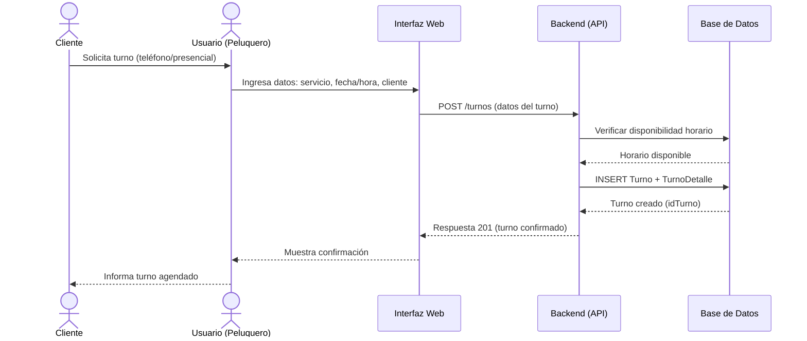
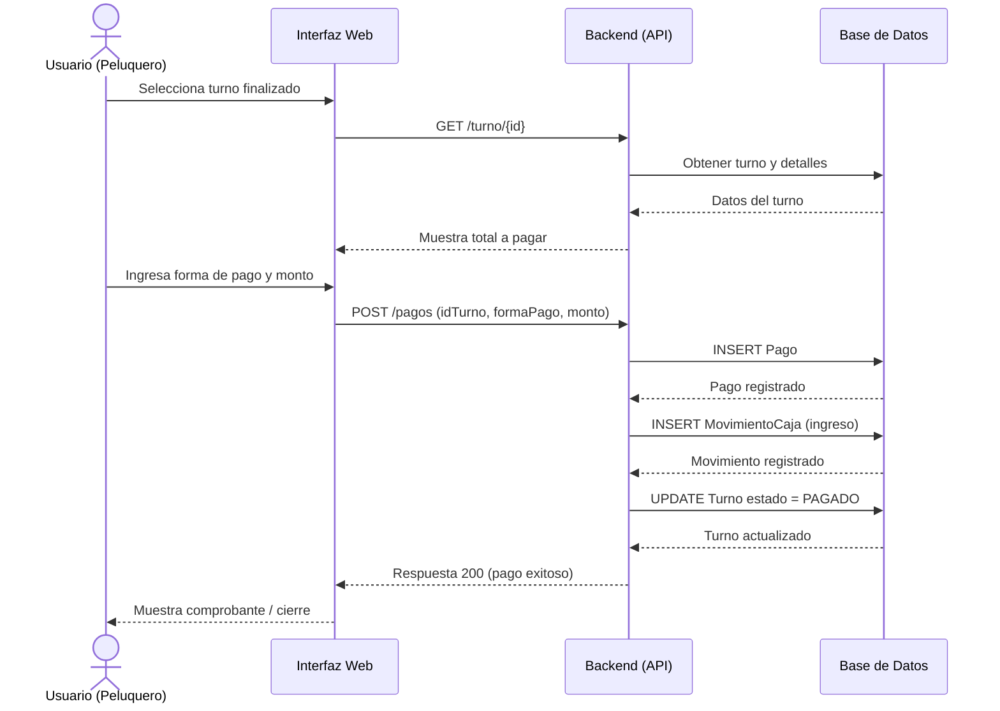
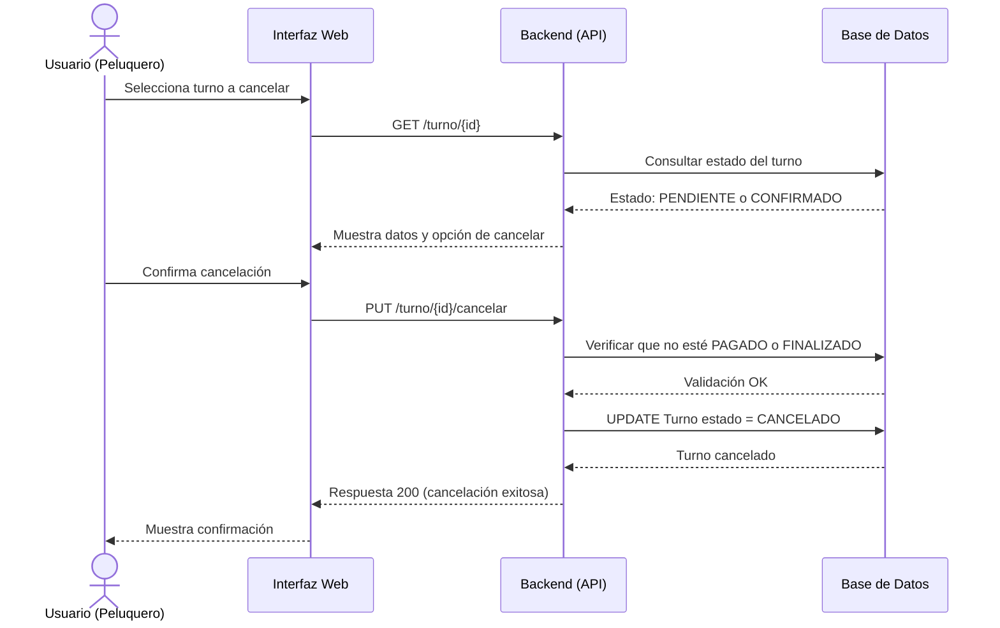
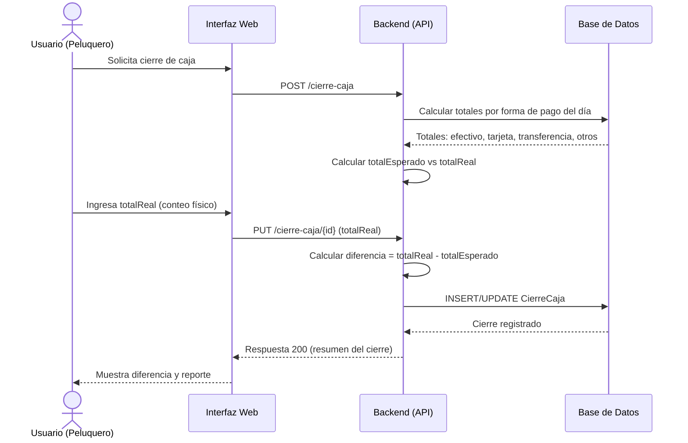
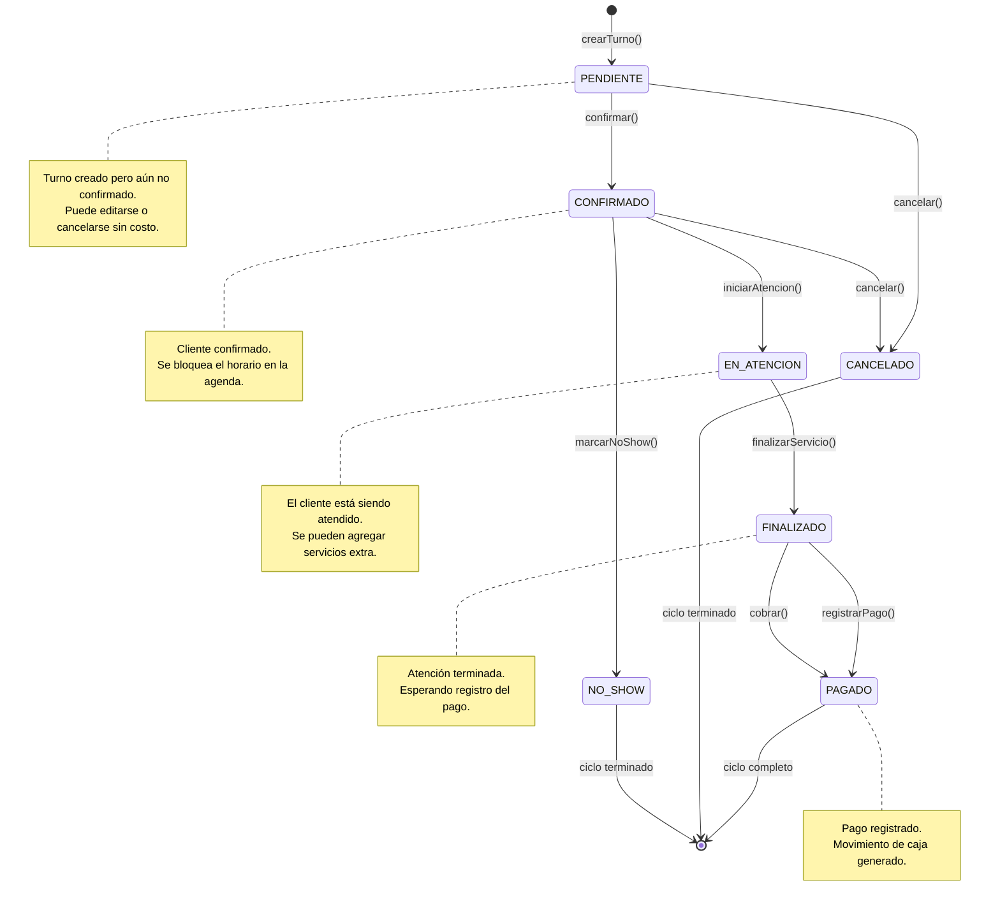
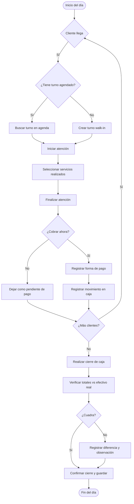

# Diagramas de Procesos – Sistema de Peluquería

---

## 1. Diagramas de Secuencia

### 1.1. Agendar Turno

### 1.2. Cobrar en Caja

### 1.3. Cancelar Turno

### 1.4. Cierre de Caja Diario

---

## 2. Diagrama de Estados – Turno

---

## 3. Diagrama de Actividades – Flujo del Día

---

## Resumen

| Diagrama | Propósito |
|----------|-----------|
| **Secuencia** | Detalla la interacción paso a paso entre el usuario, la interfaz, el backend y la base de datos para cada operación crítica. |
| **Estados – Turno** | Modela el ciclo de vida completo de un turno, desde su creación hasta su cierre, incluyendo estados intermedios y transiciones. |
| **Actividades** | Visualiza el flujo de trabajo global en la peluquería durante una jornada completa. |

Estos diagramas te sirven como base para desarrollar los endpoints de la API, las pantallas del frontend y las reglas de negocio en el backend.
